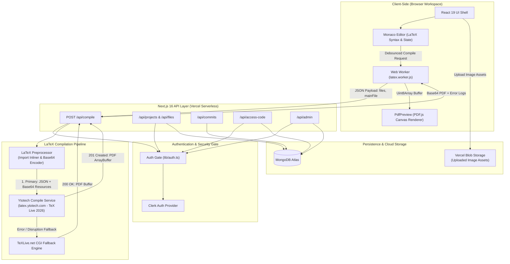
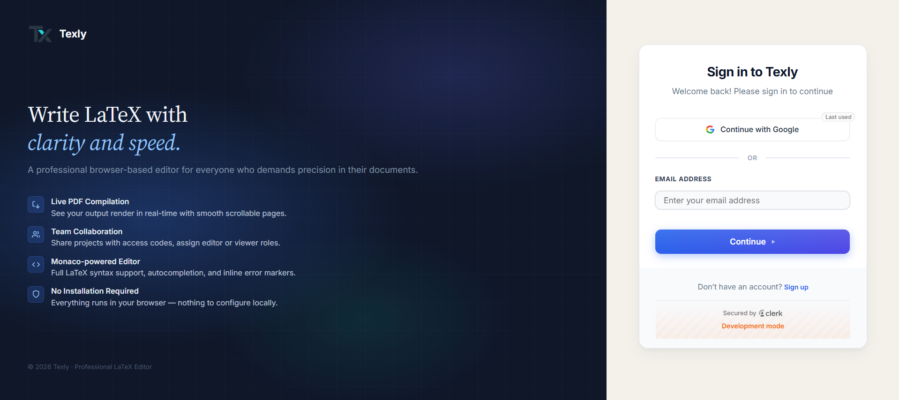
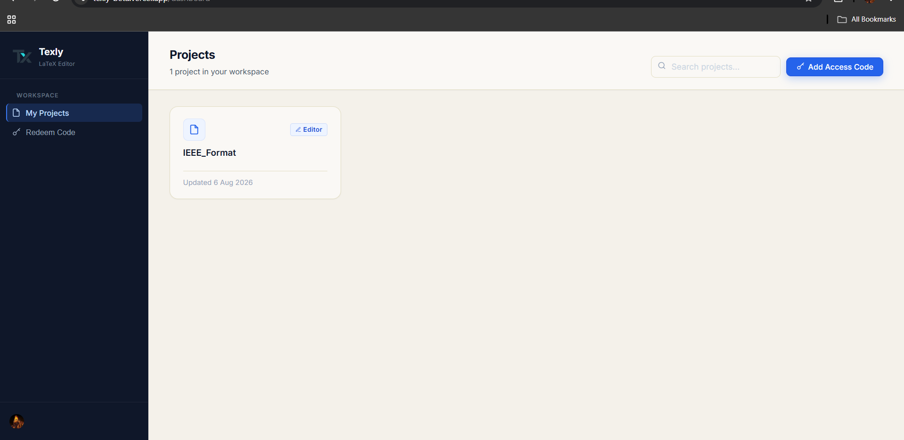
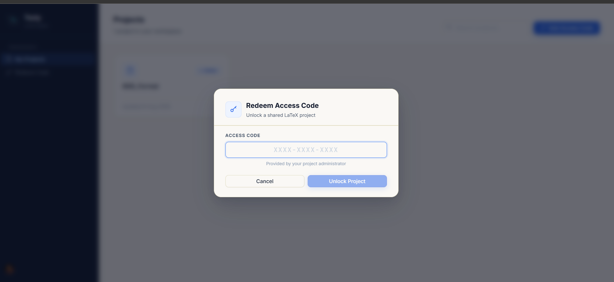
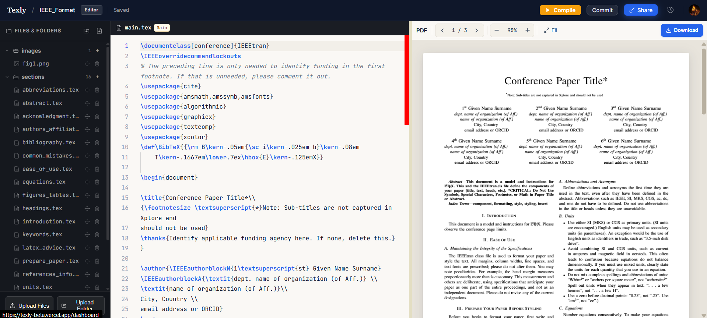
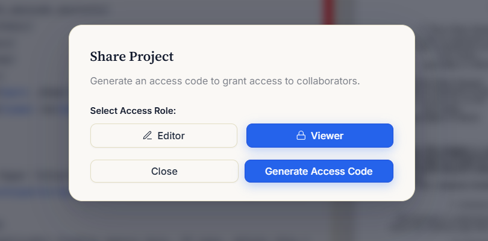
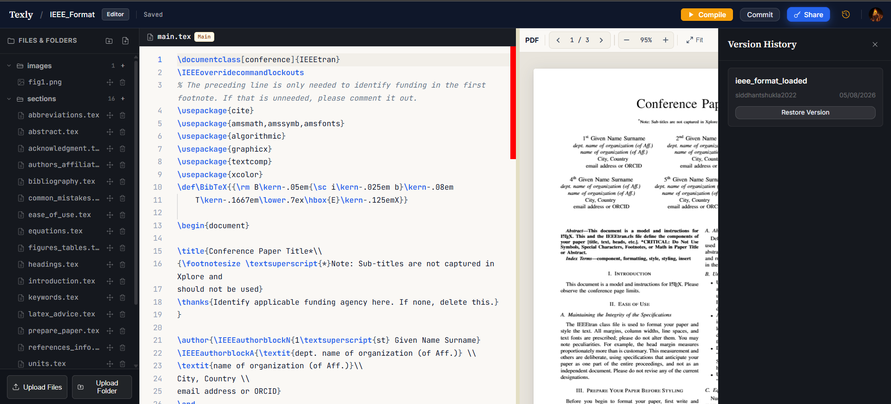

<p align="center">
  
</p>

<h1 align="center">Texly — Modern Web-Based LaTeX Editor</h1>

<p align="center">
  <strong>Write, compile, and preview full-featured LaTeX documents directly in your browser.</strong><br/>
  Powered by Next.js 16, Monaco Editor, TeX Live 2026 compilation API, MongoDB Atlas, and Clerk Authentication.
</p>

<p align="center">
  <a href="https://github.com/Siddhantshukla1657/Texly">
    
  </a>
  
  
  
  
  
</p>

---

##  &nbsp;Executive Overview

**Texly** is a high-performance, web-based LaTeX editing platform designed specifically for research papers, academic journals, and complex technical documentation. It provides a focused, browser-based alternative to heavy commercial SaaS platforms like Overleaf.

Texly eliminates the need for local TeX distributions or long-running compile servers by leveraging a serverless API proxy (`/api/compile`) that routes preprocessed LaTeX payloads to **Ytotech's TeX Live 2026** engine, with native Base64 graphics handling and automatic failover to **TeXLive.net**.

---

##  &nbsp;Core Features

| Feature | Description |
|---|---|
| **Monaco Code Editor** | VS Code-powered LaTeX editing interface with syntax highlighting, line numbers, automatic bracket completion, and multi-cursor selection. |
| **TeX Live 2026 Compilation** | Fast server-proxied LaTeX compilation via `/api/compile` powered by Ytotech TeX Live 2026, with automatic fallback to TeXLive.net. |
| **Native Base64 Image Support** | Direct rendering of binary `.png`, `.jpg`, `.jpeg`, and `.pdf` graphics via Base64 resource payloads without placeholder box hacks. |
| **Multi-File & Inlining Preprocessor** | Recursive `\input{}` and `\include{}` import resolution across project folders, with `.cls`, `.sty`, and `.bib` preamble filecontents embedding. |
| **PDF.js Canvas Preview** | High-DPI canvas preview renderer (`pdfjs-dist`) with multi-page scrolling, auto-fit, zoom controls, and instant PDF downloads. |
| **Role-Based Access Control** | Secure Clerk authentication integrated with project access codes (`Editor` vs. `Viewer` roles) and automated administrator routing. |
| **Commit History & Version Control** | Create named document snapshots, inspect file tree diffs, and restore workspace files to historic commits without data loss. |
| **Admin Control Portal** | Dedicated `/admin` dashboard for platform administrators to manage users, grant/revoke permissions, and regenerate project access codes. |

---

##  &nbsp;System Architecture

The following diagram illustrates Texly's complete system request flow, from user editing in Monaco Editor to Next.js API processing, LaTeX compilation via TeX Live 2026, and PDF canvas rendering:



---

##  &nbsp;Technical Deep Dive: Compilation Pipeline

Texly processes LaTeX compilation requests through a multi-stage serverless pipeline located at `/api/compile`:

1. **Client Worker Dispatching:**
   When a user edits a document or clicks the compile button, `public/latex.worker.js` dispatches an asynchronous compilation request off the main thread, keeping Monaco Editor responsive.

2. **Recursive Import Inlining:**
   The server handler identifies the main entry point (e.g., `main.tex`), parses the project file map, and recursively replaces all `\input{path}` and `\include{path}` directives with the target file contents.

3. **Preamble Filecontents Injection:**
   Auxiliary text files (`.cls`, `.sty`, `.bib`, `.bst`) present in the project file tree are wrapped inside LaTeX `filecontents*` blocks and injected into the document preamble to guarantee package availability during compilation.

4. **Base64 Image Resource Transmission:**
   Binary graphics (`.png`, `.jpg`, `.jpeg`, `.pdf`) stored as data URLs or fetched from Vercel Blob are loaded as byte arrays and sent to **Ytotech's TeX Live 2026** API (`https://latex.ytotech.com/builds/sync`) as Base64-encoded `file` items. The server writes these binary files directly to disk before executing TeX Live 2026, allowing standard `\includegraphics{...}` commands to work natively.

5. **Engine Selection & Fallback:**
   The route detects XeLaTeX packages (such as `fontspec`, `xeCJK`, or `polyglossia`) and automatically selects `xelatex`, defaulting otherwise to `pdflatex`. If Ytotech encounters network disruptions, Texly falls back to TeXLive.net.

6. **Log Parsing & PDF Canvas Rendering:**
   If compilation succeeds, the returned PDF buffer is base64-encoded and sent back to `latex.worker.js`, which converts it to a `Uint8Array` for crisp canvas rendering via PDF.js. If compilation fails, LaTeX `!` error lines are extracted from the log and formatted for user inspection.

---

##  &nbsp;Technology Stack

| Category | Technology | Purpose |
|---|---|---|
| **Framework** | Next.js 16 (App Router) | React Server Components, Client Components, and Route Handlers |
| **Language** | TypeScript 5 | End-to-end static typing |
| **Code Editor** | Monaco Editor (`@monaco-editor/react`) | Browser-based VS Code editing engine |
| **PDF Rendering** | PDF.js (`pdfjs-dist`) | High-DPI client canvas PDF preview renderer |
| **Primary LaTeX Service** | Ytotech API (TeX Live 2026) | Hosted LaTeX compilation endpoint with Base64 resource payloads |
| **Fallback LaTeX Service** | TeXLive.net CGI | Secondary fallback compilation engine |
| **Authentication** | Clerk (`@clerk/nextjs`) | Session management, OAuth logins, and user credentials |
| **Database** | MongoDB Atlas & Mongoose | Schemas for users, projects, files, commits, and access codes |
| **Asset Storage** | Vercel Blob (`@vercel/blob`) | Cloud storage for uploaded image graphics and figures |

---

##  &nbsp;Getting Started

### Prerequisites

Ensure the following tools are installed locally:
- **Node.js** v18.0.0 or higher
- **npm** or **yarn**
- A **MongoDB Atlas** database cluster
- A **Clerk** application project

---

### Local Installation & Setup

1. **Clone the repository:**
   ```bash
   git clone https://github.com/Siddhantshukla1657/Texly.git
   cd Texly
   ```

2. **Install dependencies:**
   ```bash
   npm install
   ```

3. **Configure Environment Variables:**
   Create a `.env.local` file in the root directory:

   ```env
   # Clerk Authentication Keys
   NEXT_PUBLIC_CLERK_PUBLISHABLE_KEY=pk_test_...
   CLERK_SECRET_KEY=sk_test_...
   CLERK_WEBHOOK_SECRET=whsec_...

   # Clerk Redirect Routes
   NEXT_PUBLIC_CLERK_SIGN_IN_URL=/sign-in
   NEXT_PUBLIC_CLERK_SIGN_UP_URL=/sign-up
   NEXT_PUBLIC_CLERK_SIGN_IN_FALLBACK_REDIRECT_URL=/
   NEXT_PUBLIC_CLERK_SIGN_UP_FALLBACK_REDIRECT_URL=/

   # MongoDB Connection String
   MONGODB_URI=mongodb+srv://<username>:<password>@<cluster>.mongodb.net/texly?retryWrites=true&w=majority

   # Vercel Blob Storage Token
   BLOB_READ_WRITE_TOKEN=vercel_blob_rw_...
   ```

4. **Start the Development Server:**
   ```bash
   npm run dev
   ```

5. Open [http://localhost:3000](http://localhost:3000) in your browser.

---

##  &nbsp;Administrator Authorization

Texly uses dynamic database-driven authorization (`isAdmin: boolean` on MongoDB `User` documents). Initial administrator setup works through three clean mechanisms:

1. **Automatic First-User Bootstrapping:**
   When setting up Texly with a fresh database, the **very first user** who registers and signs in is automatically designated as the initial Platform Administrator (`isAdmin: true`).

2. **Environment Variable Configuration (Optional):**
   You can specify `ADMIN_EMAIL=your-email@domain.com` in `.env.local`. When a user with a matching email logs in, they are automatically granted admin access.

3. **Admin Panel Management:**
   Once an administrator exists, they can grant or revoke admin privileges for any registered user directly via the interactive `/admin` dashboard.

4. **Direct Database Override (Manual):**
   Alternatively, run this MongoDB shell command after a user signs in:
   ```javascript
   db.users.updateOne({ email: "you@domain.com" }, { $set: { isAdmin: true } })
   ```

---

##  &nbsp;Feature Screenshots

<div align="center">
  <h3>1. Authentication & Sign-In</h3>
  <p>Secure user authentication interface powered by Clerk with support for OAuth providers, email magic links, and credential sign-in.</p>
  
</div>

<br/>

<div align="center">
  <h3>2. User Workspace & Project Dashboard</h3>
  <p>Central workspace dashboard listing all accessible LaTeX projects with role badges (Editor vs. Viewer), project creation modal, and access code redemption actions.</p>
  
</div>

<br/>

<div align="center">
  <h3>3. Access Code Redemption Modal</h3>
  <p>Interactive popup dialog allowing team members to enter per-project access codes and redeem workspace permissions.</p>
  
</div>

<br/>

<div align="center">
  <h3>4. Monaco LaTeX Editor & PDF Canvas Preview Workspace</h3>
  <p>Full-featured browser editing environment equipped with Monaco Code Editor (syntax highlighting, line numbers), real-time TeX Live 2026 compilation toolbar, PDF.js canvas previewer, and compilation log panel.</p>
  
</div>

<br/>

<div align="center">
  <h3>5. Project Access & Code Sharing Control</h3>
  <p>Management dialog for viewing hashed project access codes, rotating keys, and managing collaborator privileges.</p>
  
</div>

<br/>

<div align="center">
  <h3>6. Project Overview & File Inspection</h3>
  <p>Detailed view displaying project metadata, file tree structure, and historic commit snapshots.</p>
  
</div>

---

##  &nbsp;Project Structure

```
Texly/
├── app/
│   ├── access-code/        # Access code redemption page
│   ├── admin/              # Admin dashboard & user access management
│   ├── api/
│   │   ├── access-code/    # Code validation & redemption route
│   │   ├── admin/          # Admin-only user & role routes
│   │   ├── compile/        # TeX Live 2026 compilation pipeline & preprocessor
│   │   ├── files/          # File CRUD operations
│   │   ├── me/             # User role & permission inspection
│   │   └── projects/       # Project CRUD, commits, and assets
│   ├── dashboard/          # User project dashboard
│   ├── projects/[id]/      # Main editor workspace (Monaco + PDF preview)
│   ├── sign-in/            # Clerk sign-in page
│   ├── sign-up/            # Clerk sign-up page
│   ├── globals.css         # Design tokens & custom CSS rules
│   ├── layout.tsx          # Root layout & providers
│   └── page.tsx            # Auth gate & landing router
├── components/
│   └── editor/
│       ├── MonacoEditor.tsx # Monaco LaTeX code editor component
│       └── PdfPreview.tsx   # PDF.js canvas preview component
├── docs/                   # System documentation
│   ├── architecture.md     # Technical system architecture
│   ├── design.md           # Visual design & UI guidelines
│   ├── feature.md          # Feature matrix & specifications
│   ├── phases.md           # Project roadmap & milestones
│   ├── prd.md              # Product requirements document
│   └── todo.md             # Development task tracker
├── lib/
│   ├── auth.ts             # Server-side auth helpers & role guards
│   ├── db.ts               # MongoDB Mongoose connection handler
│   └── models.ts           # Mongoose schemas (User, Project, Access, Commit)
├── public/
│   ├── logo.png            # Application logo
│   └── latex.worker.js     # Async compilation Web Worker
└── next.config.ts          # Next.js configuration settings
```

---

##  &nbsp;Production Deployment (Vercel)

1. Push your repository code to GitHub.
2. Import the project into **Vercel**.
3. Configure all environment variables from `.env.local` under **Project Settings → Environment Variables**.
4. Configure MongoDB Atlas Network Access to permit connections from Vercel deployment IP ranges (`0.0.0.0/0`).
5. Deploy the application.

---

##  &nbsp;License

This project is open-source under the [MIT License](LICENSE).
