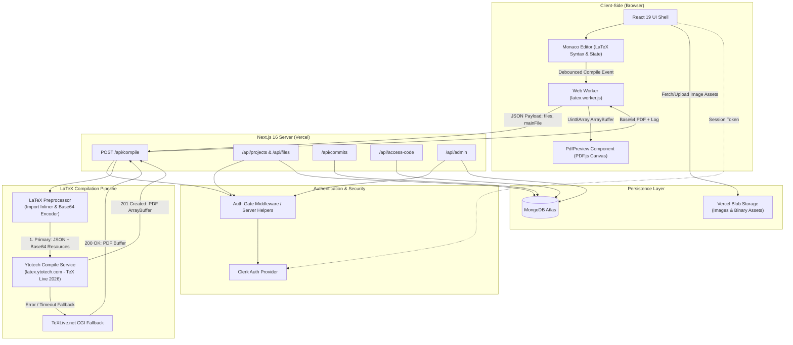

<p align="center">
  
</p>

<h1 align="center">Texly — Modern Web-Based LaTeX Editor</h1>

<p align="center">
  <strong>Write, compile, and preview full-featured LaTeX documents directly in your browser.</strong><br/>
  Powered by Next.js 16, Monaco Editor, TeX Live 2026 compilation API, MongoDB Atlas, and Clerk Authentication.
</p>

<p align="center">
  <a href="https://github.com/Siddhantshukla1657/Texly">
    
  </a>
  
  
  
  
  
</p>

---

## 🌟 &nbsp;Overview

**Texly** is a high-performance, browser-based LaTeX editing environment designed for research papers, technical documentation, and academic writing. Built as a streamlined alternative to complex multi-tenant SaaS tools, Texly provides VS Code-grade editing, real-time PDF canvas rendering, multi-file project management, version control snapshots, and secure access code sharing.

---

## ⚡ &nbsp;Key Features

| Feature | Description |
|---|---|
| 📝 **Monaco Code Editor** | Full-featured LaTeX editing powered by VS Code's Monaco engine — featuring syntax highlighting, line numbers, auto-closing brackets, and multi-cursor editing. |
| 🚀 **High-Performance Compilation** | Fast server-proxied LaTeX compilation via `/api/compile` powered by **Ytotech TeX Live 2026** with secondary fallback to **TeXLive.net**. |
| 🖼️ **Native Image & Asset Support** | Direct binary PNG, JPG, and PDF graphics rendering in documents using Base64 resource payloads (no placeholder tricks required). |
| 📁 **Multi-File & Inlining Resolution** | Multi-file LaTeX project support with automatic recursive `\input{}` and `\include{}` import resolution and preamble package embedding (`.cls`, `.sty`, `.bib`). |
| 📄 **Interactive PDF.js Canvas Preview** | High-DPI responsive PDF preview rendered on canvas via `pdfjs-dist` with page navigation, auto-fit, custom zoom levels, and instant download. |
| 🔐 **Role-Based Access & Access Codes** | Secure Clerk authentication coupled with project-scoped access codes (`Editor` vs. `Viewer` roles) and automated admin routing. |
| 📜 **Commit History & Snapshots** | Create, view, diff, and restore named project document snapshots without losing progress. |
| 🛠️ **Admin Dashboard** | Dedicated `/admin` portal for managing platform users, revoking/granting access, and regenerating project security codes. |

---

## 🏗️ &nbsp;System Architecture

The following diagram illustrates Texly's complete request flow, from user interactions in Monaco Editor to Next.js API processing, LaTeX compilation via TeX Live 2026, and PDF canvas rendering:



---

## 🔬 &nbsp;Deep Dive: Compilation & Asset Pipeline

Texly's LaTeX compilation engine operates via a serverless proxy pipeline at `/api/compile`:

1. **Dependency Resolution & Inlining:**
   When a compile command is triggered, Texly parses the project file tree, locates the primary document (`main.tex` or specified `mainFile`), and recursively inlines all `\input{path}` and `\include{path}` references.

2. **Preamble Filecontents Injection:**
   Auxiliary text files (`.cls`, `.sty`, `.bib`, `.bst`) are embedded into the document preamble using LaTeX `filecontents*` blocks to ensure full package and bibliography availability.

3. **Base64 Image Resource Transmission:**
   Binary graphics (`.png`, `.jpg`, `.jpeg`, `.pdf`) stored as data URLs or fetched from Vercel Blob are converted into byte buffers and sent to **Ytotech's TeX Live 2026** API (`https://latex.ytotech.com/builds/sync`) as Base64-encoded `file` resources. The compilation server writes these binary files directly to disk before executing `pdflatex` or `xelatex`, guaranteeing native `\includegraphics{...}` execution without corruption or placeholder hacks.

4. **Dual Engine Failover:**
   If `xelatex` packages (such as `fontspec`, `xeCJK`, or `polyglossia`) are detected in the document preamble, the pipeline automatically selects XeLaTeX. If the primary engine encounters a service disruption, Texly seamlessly fails over to TeXLive.net to ensure uninterrupted editing.

---

## 🛠️ &nbsp;Technology Stack

| Category | Technology | Purpose |
|---|---|---|
| **Framework** | Next.js 16 (App Router) | Server Components, Route Handlers, and client state management |
| **Language** | TypeScript 5 | End-to-end type safety |
| **Code Editor** | Monaco Editor (`@monaco-editor/react`) | VS Code-based browser LaTeX editing interface |
| **PDF Engine** | PDF.js (`pdfjs-dist`) | High-DPI client-side PDF canvas rendering |
| **LaTeX Service** | Ytotech API (TeX Live 2026) | Primary hosted compilation backend supporting Base64 resources |
| **Fallback Service** | TeXLive.net CGI | Secondary LaTeX compilation service fallback |
| **Authentication** | Clerk (`@clerk/nextjs`) | Session management, sign-up/sign-in flows, and security |
| **Database** | MongoDB Atlas & Mongoose | Schemas for users, projects, files, commits, and access codes |
| **Asset Storage** | Vercel Blob (`@vercel/blob`) | Cloud storage for uploaded document graphics and figures |

---

## 💻 &nbsp;Getting Started

### Prerequisites

Ensure you have the following installed on your machine:
- **Node.js** v18.0.0 or higher
- **npm** or **yarn**
- A **MongoDB Atlas** database cluster
- A **Clerk** project account

---

### Local Installation

1. **Clone the repository:**
   ```bash
   git clone https://github.com/Siddhantshukla1657/Texly.git
   cd Texly
   ```

2. **Install dependencies:**
   ```bash
   npm install
   ```

3. **Configure Environment Variables:**
   Create a `.env.local` file in the project root:

   ```env
   # Clerk Authentication
   NEXT_PUBLIC_CLERK_PUBLISHABLE_KEY=pk_test_...
   CLERK_SECRET_KEY=sk_test_...
   CLERK_WEBHOOK_SECRET=whsec_...

   # Clerk Redirect Routes
   NEXT_PUBLIC_CLERK_SIGN_IN_URL=/sign-in
   NEXT_PUBLIC_CLERK_SIGN_UP_URL=/sign-up
   NEXT_PUBLIC_CLERK_SIGN_IN_FALLBACK_REDIRECT_URL=/
   NEXT_PUBLIC_CLERK_SIGN_UP_FALLBACK_REDIRECT_URL=/

   # MongoDB Connection
   MONGODB_URI=mongodb+srv://<username>:<password>@<cluster>.mongodb.net/texly?retryWrites=true&w=majority

   # Vercel Blob Storage Token
   BLOB_READ_WRITE_TOKEN=vercel_blob_rw_...
   ```

4. **Launch Development Server:**
   ```bash
   npm run dev
   ```

5. Access the application at [http://localhost:3000](http://localhost:3000).

---

## 🔑 &nbsp;Admin Authorization

Accounts registered with **`siddhantshukla2022@gmail.com`** are automatically assigned administrator privileges (`isAdmin: true`) on initial sign-in and granted full access to the `/admin` portal.

---

## 📁 &nbsp;Project Structure

```
Texly/
├── app/
│   ├── access-code/        # Access code redemption page
│   ├── admin/              # Admin dashboard & user access management
│   ├── api/
│   │   ├── access-code/    # Code validation & redemption route
│   │   ├── admin/          # Admin-only user & role routes
│   │   ├── compile/        # TeX Live 2026 compilation pipeline & preprocessor
│   │   ├── files/          # File CRUD operations
│   │   ├── me/             # User role & permission inspection
│   │   └── projects/       # Project CRUD, commits, and assets
│   ├── dashboard/          # User project dashboard
│   ├── projects/[id]/      # Main editor layout (Monaco + PDF preview)
│   ├── sign-in/            # Clerk sign-in page
│   ├── sign-up/            # Clerk sign-up page
│   ├── globals.css         # Design tokens & custom CSS
│   ├── layout.tsx          # Root application layout & providers
│   └── page.tsx            # Auth gate & landing router
├── components/
│   └── editor/
│       ├── MonacoEditor.tsx # Monaco LaTeX code editor component
│       └── PdfPreview.tsx   # PDF.js canvas preview component
├── docs/                   # Architectural & design documentation
│   ├── architecture.md     # Technical system architecture
│   ├── design.md           # Visual design & UI guidelines
│   ├── feature.md          # Feature matrix & specifications
│   ├── phases.md           # Project roadmap & milestones
│   ├── prd.md              # Product requirements document
│   └── todo.md             # Development task tracker
├── lib/
│   ├── auth.ts             # Server-side auth helpers & role guards
│   ├── db.ts               # MongoDB Mongoose connection handler
│   └── models.ts           # Mongoose schemas (User, Project, Access, Commit)
├── public/
│   ├── logo.png            # Application logo
│   └── latex.worker.js     # Async compilation Web Worker
└── next.config.ts          # Next.js configuration settings
```

---

## 🚀 &nbsp;Deployment (Vercel)

1. Push your repository to GitHub.
2. Import the project into **Vercel**.
3. Configure the environment variables listed in `.env.local` under **Project Settings → Environment Variables**.
4. Set MongoDB Atlas network access to allow connection requests from Vercel servers (`0.0.0.0/0`).
5. Trigger build and deploy!

---

## 📄 &nbsp;License

This project is open-source under the [MIT License](LICENSE).
