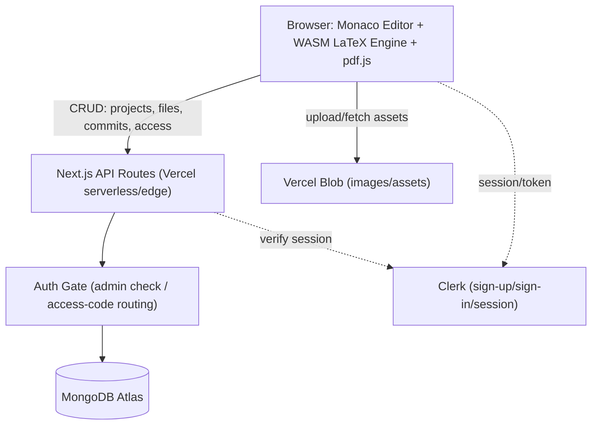
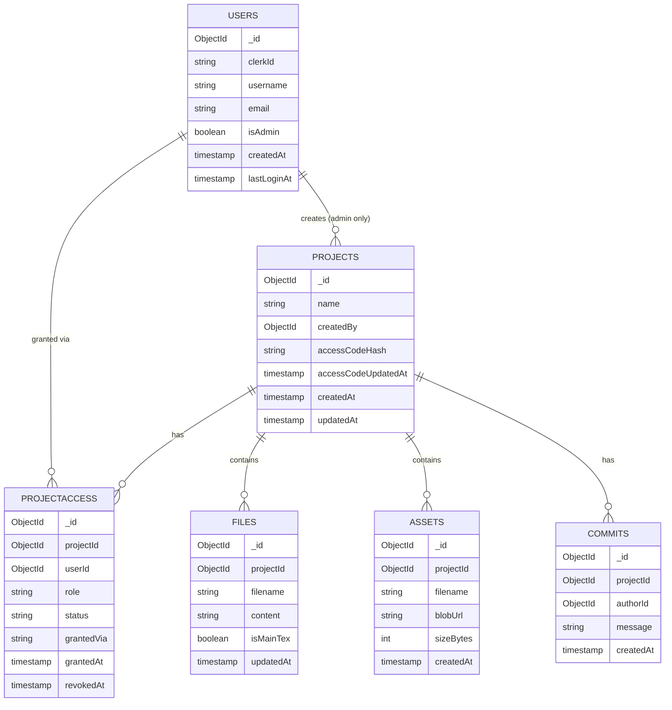

# Texly — Architecture

> **Status:** Draft | **Last updated:** August 5, 2026

## 1. System Overview
Texly runs as a single Next.js application deployed on Vercel, handling both the frontend and a thin API layer. Two deliberate choices shape everything else: LaTeX compilation happens entirely in the browser via a WASM engine, not on the server, and access control runs through a single admin account plus per-project access codes rather than open self-service signup. The backend stays limited to auth-gate logic, CRUD, and metadata — no TeX Live install, no compile queue, no invite/approval workflow to maintain. Clerk handles the mechanics of authentication (sign-up, sign-in, sessions); a custom layer on top, backed by MongoDB, decides whether a given authenticated session belongs to the admin, a user with existing project access, or a user who needs to redeem a code first.

## 2. Architecture Diagram

Compilation itself never crosses this diagram — the WASM engine runs inside the browser tab and never calls the API.

## 3. Tech Stack
| Layer | Technology | Rationale |
|---|---|---|
| Frontend | Next.js (App Router) + React | Single framework for both frontend and API, first-class Vercel deployment |
| Backend | Next.js Route Handlers on Vercel | Thin CRUD + access-gate layer only; no separate service to deploy or scale |
| LaTeX compile | SwiftLaTeX (`pdftex.js`) or equivalent WASM engine, in a Web Worker | Compiles client-side, removes the need for a TeX Live server entirely |
| PDF render | pdf.js | Renders the compiled PDF bytes in-browser without a download round-trip |
| Editor | Monaco Editor | Mature, VSCode-grade editing, good LaTeX syntax highlighting support |
| Database | MongoDB (Atlas) | Chosen stack for this project; document model fits embedded commit snapshots and per-project access records naturally |
| ODM | Mongoose | Schema shape and validation on top of MongoDB's flexibility, without hand-rolling validation in every route |
| Auth | Clerk | Handles credential storage, session security, and the login page itself; app-level logic layers admin/access-code routing on top |
| Object storage | Vercel Blob | Native to the deployment target, no separate storage account to wire up |

## 4. Component Breakdown

### 4.1 Editor Shell
- **Responsibility:** Hosts the file tree, Monaco instance, and PDF preview pane; owns local edit state and triggers autosave + recompile.
- **Interfaces:** Reads/writes files via the Project API; passes current file contents to the Compile Worker.
- **Depends on:** Compile Worker, Project API.

### 4.2 Compile Worker
- **Responsibility:** Runs the WASM LaTeX engine off the main thread, takes in-memory file contents, returns compiled PDF bytes or an error log.
- **Interfaces:** `postMessage` in (file map) / out (PDF bytes or error log) between main thread and worker.
- **Depends on:** Nothing server-side — fully self-contained once the WASM engine is loaded.

### 4.3 Project API
- **Responsibility:** CRUD for projects and files. Project creation is admin-only; file read/write requires an active access grant.
- **Interfaces:** REST-style Route Handlers under `/api/projects/*`.
- **Depends on:** MongoDB (Atlas), Auth Gate.

### 4.4 Commit API
- **Responsibility:** Creates snapshots of current file state, lists history, computes/serves diffs, handles restore.
- **Interfaces:** `/api/projects/:id/commits`, `/api/commits/:id`.
- **Depends on:** Project API's file model, MongoDB.

### 4.5 Auth Gate
- **Responsibility:** Runs on every authenticated request. Confirms the Clerk session, looks up the matching MongoDB `users` document, and determines: admin → full access; non-admin with an active access grant → scoped access to those projects; non-admin with none → blocked from project data, routed to the access-code screen client-side.
- **Interfaces:** A shared server-side helper imported by every API route; also drives the client-side redirect logic right after login.
- **Depends on:** Clerk session, MongoDB `users` and `projectAccess` collections.

### 4.6 Admin Panel
- **Responsibility:** User list, role management, per-user project access view, grant/revoke controls, per-project access-code view/regeneration.
- **Interfaces:** `/api/admin/*` routes, admin-only pages.
- **Depends on:** Auth Gate (admin check), MongoDB.

### 4.7 Access Code Redemption
- **Responsibility:** Validates a submitted code against a project's stored (hashed) code, and on success creates or reactivates a `projectAccess` document for that user.
- **Interfaces:** `/api/access-code/redeem`.
- **Depends on:** Auth Gate, MongoDB `projects` and `projectAccess` collections.

## 5. Data Model
MongoDB collections, referenced by ObjectId rather than enforced foreign keys. Commit file snapshots are embedded directly in the commit document, since a commit's contents are always read and written together as a unit — a natural fit for the document model, and simpler than the join-table approach a relational schema would need.

`COMMITS` documents carry an embedded `files: [{ fileId, filename, content }]` array rather than a separate collection — each commit is one self-contained document.

`PROJECTACCESS.role` is `editor | viewer`. Redeeming a code always creates an `editor` grant; the admin can change it afterward. `status` is `active | revoked` — access is soft-revoked rather than deleted, so the admin retains a record of who's had access to what.

## 6. API Design
| Method | Endpoint | Purpose | Auth required |
|---|---|---|---|
| GET | /api/projects | List projects the current user has active access to (all projects if admin) | Yes |
| POST | /api/projects | Create a project | Yes, admin only |
| GET | /api/projects/:id | Get project detail (files) | Yes, active access |
| PATCH | /api/projects/:id | Rename/update project | Yes, admin only |
| DELETE | /api/projects/:id | Delete project | Yes, admin only |
| GET | /api/projects/:id/files | List files | Yes, active access |
| POST | /api/projects/:id/files | Create file | Yes, editor access |
| PATCH | /api/files/:id | Update file content (autosave) | Yes, editor access |
| DELETE | /api/files/:id | Delete file | Yes, editor access |
| POST | /api/projects/:id/assets | Upload asset to Vercel Blob, create Asset doc | Yes, editor access |
| GET | /api/projects/:id/commits | List commit history | Yes, active access |
| POST | /api/projects/:id/commits | Create commit/snapshot | Yes, editor access |
| GET | /api/commits/:id | Get commit detail (diff-ready) | Yes, active access |
| POST | /api/commits/:id/restore | Restore files to this commit (creates a new commit) | Yes, editor access |
| POST | /api/access-code/redeem | Submit a code, get editor access to the matching project | Yes, any authenticated non-admin |
| GET | /api/me/access | List the current user's active project access grants (drives login-gate routing) | Yes |
| GET | /api/admin/users | List all registered users | Yes, admin only |
| PATCH | /api/admin/users/:id | Change a user's role | Yes, admin only |
| GET | /api/admin/users/:id/access | List a specific user's project access grants | Yes, admin only |
| POST | /api/admin/projects/:id/grant | Directly grant a user access to a project | Yes, admin only |
| POST | /api/admin/projects/:id/revoke | Revoke a user's access to a project | Yes, admin only |
| GET | /api/admin/projects/:id/code | View a project's current access code | Yes, admin only |
| POST | /api/admin/projects/:id/code/regenerate | Rotate a project's access code | Yes, admin only |

## 7. Infrastructure & Deployment
- Single Vercel project, deployed via Git integration (push to main → production deploy, PRs get preview deployments).
- Environment variables: MongoDB Atlas connection string, Clerk keys, Vercel Blob token.
- No build-time TeX install and nothing to containerize — the WASM engine ships as a static asset bundled with the frontend.
- The admin account is seeded once (a specific Clerk `clerkId` flagged `isAdmin: true` in the `users` collection) rather than assigned through any in-app flow, since v1 assumes exactly one admin.

## 8. Security Considerations
- Every API route verifies the Clerk session before touching data.
- The Auth Gate centralizes admin/access checks in one place, so route handlers don't each reimplement the logic.
- Access codes are hashed at rest (bcrypt or equivalent) and compared via hash on redemption — a database leak doesn't hand out live codes directly.
- Role checks (`editor` vs `viewer`) gate mutation routes: viewers can hit GET routes but not PATCH/POST/DELETE.
- Admin-only routes (`/api/admin/*`, project creation, project delete/rename) check `isAdmin` explicitly, independent of the general access-grant check.
- All writes go through the API; the client never talks to MongoDB or Blob storage directly except for asset upload, which still requires a signed upload URL issued by an authorized route.
- Filenames are sanitized/validated server-side before being persisted or used to build Blob paths.

## 9. Scalability & Performance
Offloading compilation to the client keeps server load roughly flat regardless of compile volume — the Vercel backend only ever handles small CRUD payloads and access checks. MongoDB Atlas and Vercel Blob both scale automatically; given the expected load (one admin, a small number of regular users, a handful of projects), no capacity planning is needed for v1.

## 10. Key Technical Decisions & Tradeoffs
| Decision | Alternatives considered | Why this choice |
|---|---|---|
| Client-side WASM LaTeX compile | Server-side compile via containerized TeX Live | Keeps the entire stack on Vercel with zero compile infrastructure; tradeoff is bounded package support |
| MongoDB with embedded commit snapshots | Relational schema (Postgres) with a join table for commit files | Matches the chosen stack, and a commit's file snapshots are naturally one document rather than a set of joined rows |
| Single admin + per-project access codes, self-service redemption | Owner-driven search-and-invite flow (per-user, requires the invited person to already have an account and be found by search) | Matches the requirement directly: one controlling admin, pull-based access via a shared secret, no per-invite management overhead |
| Clerk for auth mechanics, custom Mongo-backed gate for admin/access logic | Fully custom auth (hand-rolled password hashing, sessions) | Keeps credential/session security in a vetted provider's hands while leaving full control over the admin/access-code business logic |
| Soft-revoke (`status: revoked`) instead of deleting access records | Hard delete on revoke | Keeps a record for the admin of who's had access to what, without extra tooling |

## 11. Open Technical Questions
- [ ] Final WASM engine choice — needs a quick spike comparing `pdftex.js` vs `xetex.js` vs Tectonic-wasm against a real research-paper document.
- [ ] Whether to rate-limit `/api/access-code/redeem` against repeated invalid guesses.
- [ ] Whether regenerating a project's access code should also prompt/notify existing users with access, or stay silent since their access isn't affected.
