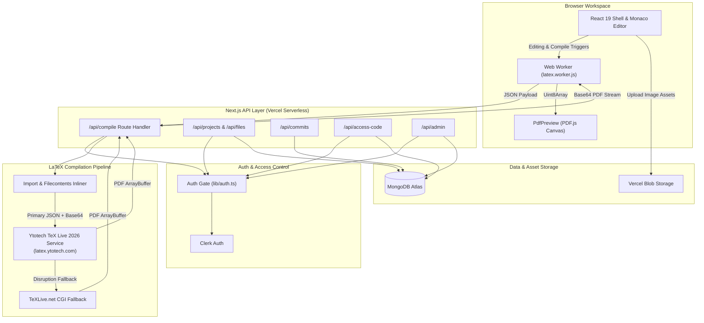
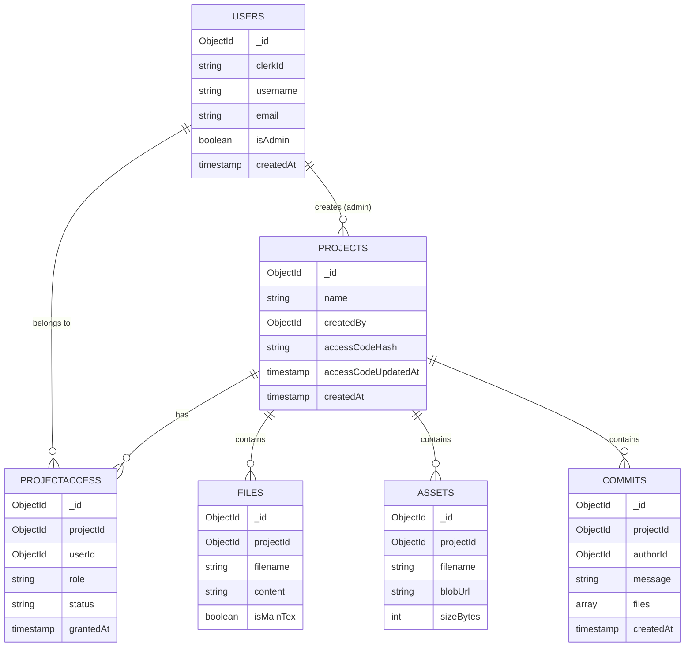

# Texly — Architecture

> **Status:** Production Architecture | **Last updated:** August 5, 2026

## 1. System Overview

Texly operates as a single Next.js 16 application deployed on Vercel, combining a modern React 19 frontend with a set of serverless API Route Handlers.

Two core architectural decisions shape the system:
1. **Server-Proxied TeX Live 2026 Compilation Engine:** LaTeX compilation is handled by a serverless API proxy (`/api/compile`) that preprocesses LaTeX sources (inlining `\input`/`\include` directives and resolving auxiliary preamble files) and dispatches JSON payloads with Base64 binary image resources to **Ytotech's TeX Live 2026** API (`https://latex.ytotech.com/builds/sync`), backed by **TeXLive.net** as a failover compiler.
2. **Role-Gated Access & Access Code Authorization:** Authentication is managed via Clerk, while app-level authorization runs through a custom Mongoose/MongoDB access gate (`lib/auth.ts`). Exactly one administrator account (`isAdmin: true`) has full system oversight, while non-admin users access projects by redeeming hashed per-project access codes.

---

## 2. Architecture Diagram

---

## 3. Tech Stack

| Layer | Technology | Rationale |
|---|---|---|
| **Frontend Framework** | Next.js 16 (App Router) + React 19 | Single framework for SSR, client components, and API route handlers |
| **Code Editor** | Monaco Editor (`@monaco-editor/react`) | VS Code editing engine with LaTeX syntax highlighting, bracket matching, and multi-cursor support |
| **PDF Renderer** | PDF.js (`pdfjs-dist`) | High-DPI canvas rendering directly in-browser with zoom and page controls |
| **Primary Compiler** | Ytotech API (`https://latex.ytotech.com/builds/sync`) | TeX Live 2026 hosted compilation endpoint supporting JSON payloads with Base64 image files |
| **Fallback Compiler** | TeXLive.net CGI | Secondary LaTeX compilation service fallback |
| **Database** | MongoDB Atlas & Mongoose | Flexible document model for storing embedded commit snapshots and project access records |
| **Authentication** | Clerk (`@clerk/nextjs`) | Secure session issuance, credential management, and OAuth authentication |
| **Asset Storage** | Vercel Blob (`@vercel/blob`) | Cloud storage for uploaded image assets and figures |

---

## 4. Component Breakdown

### 4.1 Editor Shell (`components/editor/MonacoEditor.tsx` & `PdfPreview.tsx`)
- **Responsibility:** Hosts the file tree navigation, Monaco code editor, and interactive PDF preview.
- **Interfaces:** Communicates with `/api/projects/[id]/files` for CRUD and delegates compile requests to `latex.worker.js`.

### 4.2 Compile Web Worker (`public/latex.worker.js`)
- **Responsibility:** Runs compilation requests off the main UI thread to keep Monaco smooth. Converts PDF Base64 response strings into `Uint8Array` binary buffers for PDF.js canvas rendering.

### 4.3 Compilation Route (`app/api/compile/route.ts`)
- **Responsibility:** 
  1. Resolves `\input{}` and `\include{}` directives recursively across project files.
  2. Embeds `.cls`, `.sty`, and `.bib` auxiliary files into document preambles.
  3. Converts image assets into Base64 resources and submits JSON requests to Ytotech TeX Live 2026.
  4. Parses compilation errors or log tails if compilation fails.

### 4.4 Auth Gate (`lib/auth.ts`)
- **Responsibility:** Verifies Clerk sessions on every API request and looks up user roles in MongoDB `users` and `projectAccess` collections.
- **Access Logic:**
  - `isAdmin: true` → Unrestricted access to all projects and admin management routes.
  - Active `editor` / `viewer` grant → Scoped access to specified project.
  - No active grant → Access denied; client redirected to `/access-code`.

### 4.5 Project & Commit APIs (`app/api/projects` & `app/api/commits`)
- **Responsibility:** Manages project files, image asset uploads to Vercel Blob, and immutable commit snapshots.

### 4.6 Access Code Redemption (`app/api/access-code`)
- **Responsibility:** Validates hashed access codes submitted by users and generates active `projectAccess` records.

---

## 5. Data Model

---

## 6. API Endpoint Reference

| Method | Endpoint | Purpose | Authorization |
|---|---|---|---|
| **POST** | `/api/compile` | Preprocesses LaTeX source and compiles PDF via Ytotech TeX Live 2026 | Active Project Access |
| **GET** | `/api/projects` | List projects accessible to current user | Authenticated User |
| **POST** | `/api/projects` | Create a new project | Admin Only |
| **GET** | `/api/projects/:id` | Get project files & metadata | Active Access |
| **PATCH** | `/api/projects/:id` | Update project details | Admin Only |
| **DELETE** | `/api/projects/:id` | Delete project | Admin Only |
| **POST** | `/api/projects/:id/files` | Create a document file | Editor Access |
| **PATCH** | `/api/files/:id` | Autosave file content | Editor Access |
| **DELETE** | `/api/files/:id` | Delete file | Editor Access |
| **POST** | `/api/projects/:id/assets` | Upload image asset to Vercel Blob | Editor Access |
| **GET** | `/api/projects/:id/commits` | List project commit history | Active Access |
| **POST** | `/api/projects/:id/commits` | Create a snapshot commit | Editor Access |
| **POST** | `/api/commits/:id/restore` | Restore document to a commit snapshot | Editor Access |
| **POST** | `/api/access-code/redeem` | Redeem project access code | Authenticated User |
| **GET** | `/api/admin/users` | List all platform users | Admin Only |
| **PATCH** | `/api/admin/users/:id` | Update user admin status | Admin Only |
| **POST** | `/api/admin/projects/:id/grant` | Directly grant project access | Admin Only |
| **POST** | `/api/admin/projects/:id/revoke` | Revoke project access | Admin Only |

---

## 7. Security & Infrastructure

- **Session Verification:** Every API handler validates the Clerk session token before executing queries.
- **Password & Code Security:** Access codes are hashed at rest using standard security routines before storage in MongoDB.
- **Deployment:** Single Next.js project on Vercel with automatic continuous integration from GitHub `main`.
