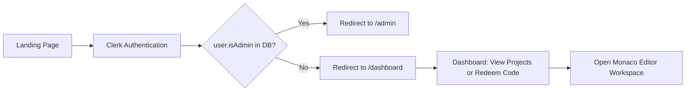
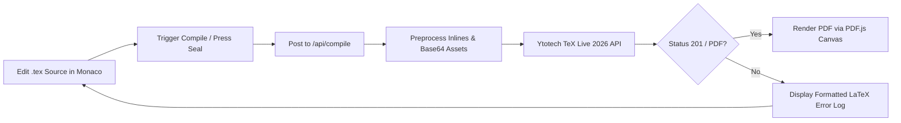
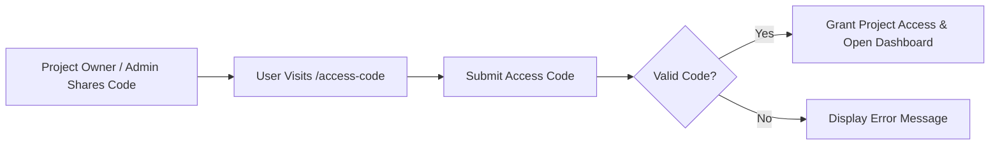

# Texly — Design Document

> **Status:** Production Visual Identity & Architecture | **Last updated:** August 5, 2026

## 0. Visual Identity Rationale

Texly's core visual theme centers around a transformation: raw `.tex` code on one side becomes a rendered document on the other.

**The concept — "Ink and Parchment":**
- The editor pane is dark, monospace, ink-on-slate.
- The preview pane is light, serif, ink-on-parchment.
- The contrast forms the spine of the entire application interface. The dashboard sidebar and nav stay in the dark "ink" tone; the content areas stay in the light "parchment" tone.

**Design Highlights:**
- **Primary Accent:** Deep verdigris green rather than electric blue or standard SaaS colors.
- **Signature Element:** The compile action is styled as a circular "wax seal" badge.
- **Pane Split:** The vertical divider between editor and preview pane features a stitched seam style inspired by book-binding thread.

---

## 1. Design Principles

- **Editor-First Chrome:** Monaco editor and PDF canvas preview dominate the layout; navigation and metadata panels stay unobtrusive.
- **Dynamic Compile Feedback:** Clear state feedback during compilation (compiling pulse animation, PDF update, or structured LaTeX error log).
- **Explicit Role Visibility:** `Editor` vs. `Viewer` permissions are highlighted in the UI shell.
- **SVG Icon System:** Clean stroke-based SVG icons used across navigation, toolbars, and status badges.

---

## 2. User Flows

### 2.1 Sign up & Routing

### 2.2 Edit → Compile → Preview Flow

### 2.3 Access Code Redemption

---

## 3. Key Workspace Views

### 3.1 Dashboard (`/dashboard`)
- **Surface:** Dark Ink sidebar + Light Parchment project grid.
- **Elements:** Project cards with role badges (`Editor` / `Viewer`), "New Project" creation modal (Admin), access code redemption input field.

### 3.2 Main Workspace (`/projects/[id]`)
- **Surface:** Dual-pane split — Ink editor pane on the left, Parchment PDF preview pane on the right.
- **Elements:** File tree navigation, Monaco code editor, stitched seam divider, wax seal Compile button, PDF zoom controls, and commit history panel.

### 3.3 Access Code Page (`/access-code`)
- **Surface:** Parchment centered card.
- **Elements:** Single grouped access code input field, submission status, and project redirection banner.