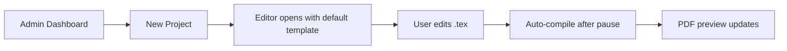
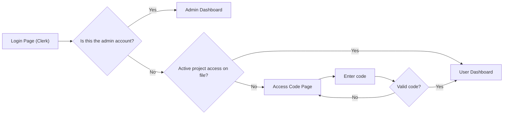
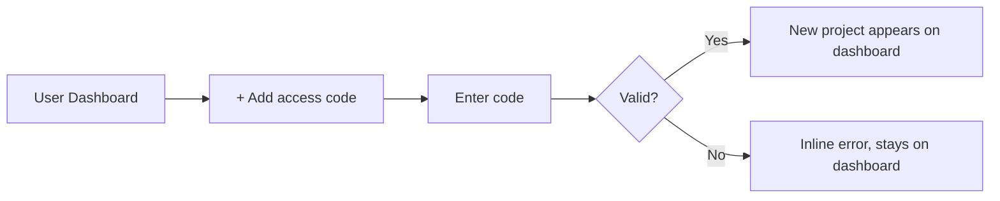
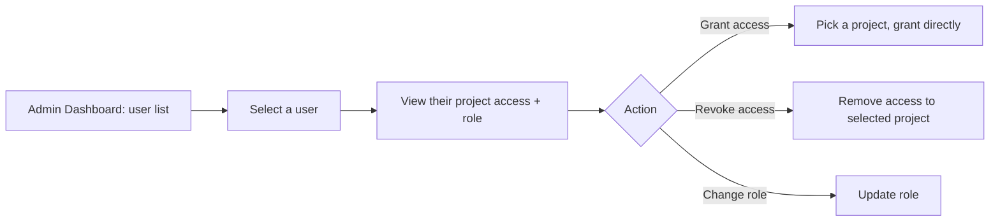
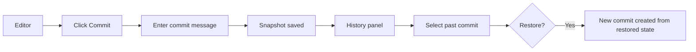

# Texly — Design Document

> **Status:** Draft | **Last updated:** August 5, 2026

## 1. Design Principles
- **The editor is the center of gravity.** File tree, history, and admin tools are side panels or separate pages — never something that blocks writing.
- **Live feedback over manual steps.** Compile-on-pause by default, though a manual trigger still exists.
- **Access is either instant or not there.** No pending/approval state for regular users — a valid code grants access immediately; an invalid one just fails.
- **The admin sees everything in one place.** User list, roles, and per-project access all live under one panel, not scattered across separate pages.
- **Errors point at the line, not just the log.** Compile errors surface inline in the editor where possible.
- **Desktop-first, no apology.** The interface assumes a real keyboard and a wide screen.

## 2. User Flows

### 2.1 Creating and writing a project (admin only)

Only the admin sees "New Project." Regular users never encounter this button — their dashboard only ever shows projects they've been granted access to.

### 2.2 Login & access gate (2-page flow)

Everyone authenticates through the same Clerk login. What happens next depends entirely on the account: the admin lands straight on their dashboard, a regular user with at least one active grant skips straight to theirs, and a brand-new regular user is stopped at the access-code page until they enter something valid. There's no separate "sign up as a regular user" path — creating a Clerk account and having zero access grants naturally lands you on the code page.

### 2.3 Redeeming an additional access code (from the dashboard)

Same redemption logic as the login gate, just reachable any time from an already-populated dashboard rather than only on first login.

### 2.4 Admin manages a user

### 2.5 Commit and restore

Restoring never destroys history — it writes a fresh commit matching the restored point.

## 3. Key Screens / Views

### 3.1 Login page
- **Purpose:** Single entry point for everyone, admin included.
- **Key elements:** Clerk-hosted (or embedded) sign-in/sign-up form.
- **States:** default; error (bad credentials, handled by Clerk).

### 3.2 Access code page
- **Purpose:** Gate that a non-admin user with zero project access must clear before seeing anything.
- **Key elements:** Single code input, submit button, brief explanation text ("Ask the project owner for an access code").
- **States:** default; invalid code (inline error, stays on this page); success (redirects to dashboard).

### 3.3 User dashboard
- **Purpose:** Shows a regular user every project they currently have active access to.
- **Key elements:** Project cards (name, last-updated, role badge), "+ Add access code" affordance.
- **States:** populated (at least one project); this screen is never truly empty for a regular user, since reaching it at all requires at least one active grant.

### 3.4 Admin dashboard
- **Purpose:** Admin's home screen — every project, plus entry point to user management.
- **Key elements:** All projects (admin sees every project regardless of who has access), "New Project" button, a "Users" tab/section.
- **States:** empty (no projects yet, create prompt); populated.

### 3.5 Admin — user list & detail
- **Purpose:** See every registered user and manage their access.
- **Key elements:** User list (username/email, role, project count), click-through to a detail view showing that user's per-project access with grant/revoke/role controls.
- **States:** list view; detail view (selected user).

### 3.6 Editor
- **Purpose:** The main workspace — write, compile, preview.
- **Key elements:** File tree (left), Monaco editor (center), PDF preview (right), toolbar with compile status, manual compile button, commit button.
- **States:** compiling (yellow status dot, preview stays on last good render); error (error panel with jump-to-line); clean (green dot, preview matches source).
- **Note:** a user with `viewer` role sees this screen read-only — no commit button, no editable file tree.

### 3.7 Commit history panel
- **Purpose:** Browse and restore past states.
- **Key elements:** Chronological commit list, diff view between two selected commits, restore action.
- **States:** empty (no commits yet); populated; viewing diff.

## 4. Component Library / Style Guide
No existing design system to inherit — this proposes a minimal, dark-mode-first editor aesthetic in the spirit of VSCode/Overleaf.

| Token | Value | Usage |
|---|---|---|
| Primary color | #4F7CFF | Primary actions, active tab |
| Admin accent | #FFB454 | Reserved for admin-only UI (badges, admin nav item) so it's visually distinct from regular project UI |
| Background — editor | #1E1E2E | Editor pane |
| Background — chrome | #181825 | Sidebars, toolbar, panels |
| Font — heading/UI | Inter | Dashboard, panels, buttons |
| Font — code | JetBrains Mono | Monaco editor content |
| Spacing scale | 4 / 8 / 12 / 16 / 24 / 32 px | Consistent padding and margins across all panels |

## 5. Interaction Patterns
- Autosave indicator: small "saved" / "saving…" text near the file tree, no blocking spinner.
- Compile status as a colored dot rather than a modal spinner.
- Editor/preview split is drag-resizable.
- Manual compile shortcut (Cmd/Ctrl+Enter).
- Access-code input behaves like a one-time-password field — single text box, immediate inline validation, no multi-step wizard.
- Admin-only UI elements (New Project, Users tab, grant/revoke controls) use the admin accent color consistently, so it's always visually obvious when you're looking at an admin-level control.

## 6. Accessibility
- File tree, commit list, and admin user list are all fully keyboard-navigable.
- WCAG AA contrast target for all UI chrome (editor syntax highlighting is exempt, standard for code editors).
- Visible focus states on every interactive element, including grant/revoke buttons in the admin panel.

## 7. Responsive / Platform Behavior
Desktop-first, minimum ~1024px assumed for the full three-pane editor. Below that, the preview pane collapses behind a toggle. True mobile is read-only for v1 (compiled PDF + file browsing, no editing) — this applies to the admin panel too, since user management isn't something that needs a mobile-optimized flow for a personal tool.

## 8. Edge Cases & Error States
- Edge case: two editors save the same file within seconds of each other → last-write-wins, second save shows a toast to reload before overwriting.
- Edge case: user enters an invalid access code → inline error, no lockout in v1 (see open question in architecture.md about rate limiting).
- Edge case: admin revokes a user's access while that user has the project open → their next API call returns 403, client shows "you no longer have access to this project" and redirects to their dashboard.
- Edge case: admin regenerates a project's code while other users already have active access → those users are unaffected; only future redemption attempts with the old code fail.
- Error state: WASM engine throws a compile error → error panel shows the engine log, attempts to parse line numbers to highlight the offending line.
- Error state: asset upload exceeds the size limit → inline validation before upload starts.

## 9. Open Design Questions
- [ ] Should the admin dashboard show a live "who's currently viewing this project" indicator, or is the access list (without presence) enough for v1?
- [ ] Does the access-code page need any visual distinction between "wrong code" and "code belongs to a project you already have access to" (redundant redemption), or is a single generic error fine?
