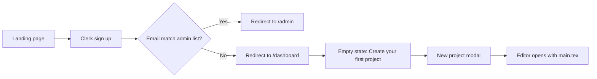
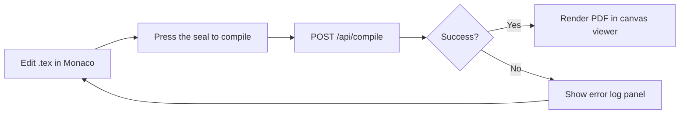
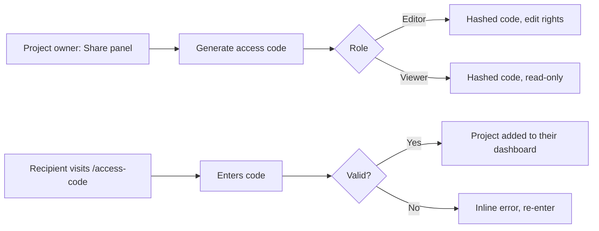

# Texly — Design Document

> **Status:** Draft v2 | **Last updated:** August 5, 2026
> This version replaces v1's generic blue/slate palette with a considered visual identity intended to be applied across the entire app — landing page, dashboard, editor, and admin.

## 0. Visual Identity Rationale

Texly's whole reason to exist is a transformation: raw `.tex` markup on one side becomes a typeset page on the other. Most LaTeX/code tools (Overleaf's green, VS Code's blue accents, generic SaaS blue-on-white) don't touch that idea at all — they could be any editor. The identity below is built directly from it.

**The concept — "ink and parchment":** the editor pane is dark, monospace, ink-on-slate. The preview pane is light, serif, ink-on-parchment. That contrast isn't just the editor screen — it's the spine of the whole product. The dashboard sidebar and nav stay in the dark "ink" tone; the content areas stay in the light "parchment" tone. A user should feel the same duality on the landing page as they do mid-compile.

**Why not the obvious choices:** a cream background with a terracotta accent is the most common AI-generated "editorial" default right now, and a near-black page with one neon accent is the second most common "developer tool" default. Texly avoids both — the light surface here is a genuine parchment (warmer, more yellow, less pink than the typical cream-plus-terracotta look), the primary accent is a deep verdigris green rather than an orange/terracotta or electric blue, and the dark surface is used deliberately as one half of a two-tone product, not as the whole app's shell.

**Signature element:** the compile action is a small circular "wax seal" badge, not a standard rectangular button. It presses down (scale + darken) on click. Where the editor and preview panes meet, the divider is styled as a stitched seam (short dashed ticks, like book-binding thread) rather than a plain 1px line. Both motifs come straight from bookbinding and manuscript proofing — the actual subject matter of the product.

## 1. Design Principles

- **Editor-first, chrome-last.** The Monaco editor and PDF preview are the product. Navigation, admin tools, and metadata stay out of the way until asked for.
- **The ink/parchment split is load-bearing, not decorative.** Every screen reinforces it: dark surfaces for input/control, light surfaces for output/content.
- **Compile feedback should never feel like a black box.** Every compile action shows progress, then either a rendered PDF or a readable error log — never a silent spinner.
- **Familiar beats novel in layout; distinctive in surface.** Anyone coming from Overleaf recognizes the editor/preview split and file tree instantly. What's different is how it looks and feels, not where things are.
- **Permissions are visible, not implicit.** Editor vs. Viewer access is shown on-screen at all times, not just enforced server-side.
- **No emoji as UI language.** Every status, feature, or action marker uses a stroke-based SVG icon from the shared icon set (Section 4.2), not an emoji glyph, so rendering stays consistent across OS/browser and icons can inherit semantic color.

## 2. User Flows

### 2.1 Sign up → First project


A new user lands on the marketing/landing view (ink header, parchment body — the split introduced immediately), signs up through Clerk, and is routed based on role. Everyone except the reserved admin account lands on an empty dashboard with a single primary action: create a project. Creating a project drops the user straight into the editor with a starter `main.tex` already open.

### 2.2 Edit → Compile → Preview


Compilation is manual and explicit — the wax-seal button, not compile-on-keystroke — so the editor stays responsive on large documents. Pressing it plays a short press-down animation (150ms scale to 0.94, amber fill deepens) before switching to a compiling state. Errors replace the PDF pane with a scrollable log in Marginalia Red; clicking a line number jumps the Monaco cursor to the matching source line.

### 2.3 Share via access code


Codes are generated per-role from within the project and copied out manually — never emailed automatically. Redemption is a dedicated page so it works as a standalone link target.

### 2.4 Admin oversight

```mermaid
flowchart LR
    A[/admin dashboard] --> B[User list]
    A --> C[Project list]
    A --> D[Active access codes]
    B --> E[Toggle admin role]
    C --> F[Inspect / revoke project access]
```
Read-heavy by default, with role toggles and access-code revocation as the only mutating actions, both behind a confirm step.

## 3. Key Screens / Views

### 3.1 Dashboard (`/dashboard`)
- **Purpose:** Entry point after login; lists the user's own and shared projects.
- **Surface:** Ink sidebar (nav, account) + Parchment content area (project grid).
- **Key elements:** Project cards (name, last edited, role badge) on Parchment with Vellum borders, "New project" seal-styled primary button, search/filter bar.
- **States:** empty — centered prompt to create a first project; loading — skeleton cards; error — inline retry banner in Marginalia Red; populated — grid of project cards sorted by last-edited.

### 3.2 Editor (`/projects/[id]`)
- **Purpose:** Core workspace — write LaTeX, manage files/assets, compile, review the PDF.
- **Surface:** This screen *is* the ink/parchment split made literal — Ink editor pane on the left, Parchment preview pane on the right, joined by the stitched-seam divider.
- **Key elements:** File tree sidebar (Ink, mono labels), Monaco editor pane (Ink bg, JetBrains Mono), stitched seam divider, PDF preview pane (Parchment bg, serif chrome), wax-seal Compile button anchored on the seam, zoom controls, commit/version history drawer, Share panel entry point.
- **States:** empty file — placeholder in muted Ink-on-Ink text; compiling — seal button presses and pulses amber; compile error — log panel in Marginalia Red replaces the PDF pane; populated — rendered multi-page PDF with zoom and page indicator.

### 3.3 Access code redemption (`/access-code`)
- **Purpose:** Standalone page for a user to redeem a shared project code.
- **Surface:** Parchment, centered card — this is an output/arrival screen, not an editing one.
- **Key elements:** Single code input field (auto-uppercase, grouped in 4s), submit button, resulting project name confirmation.
- **States:** empty — input focused, no error; loading — button spinner; error — inline Marginalia Red helper text, code cleared; success — Verdigris confirmation card with a link into the project.

### 3.4 Admin dashboard (`/admin`)
- **Purpose:** Platform oversight for the reserved admin account.
- **Surface:** Ink throughout — admin is a control surface, not a content one.
- **Key elements:** Tabbed layout — Users, Projects, Access Codes; role toggle switches in Verdigris; revoke-access buttons in Marginalia Red with confirm dialogs.
- **States:** empty — "no active codes" placeholder in that tab only; loading — table skeleton; populated — sortable table per tab.

## 4. Component Library / Style Guide

### 4.1 Color tokens

Six named colors carry the whole system. Everything else (hover/active states, tints) is derived from these at fixed opacity or lightness steps — never a new arbitrary hex.

| Token | Hex | Role |
|---|---|---|
| `ink` | `#191D24` | Dark surface (editor, sidebar, admin shell), primary text on Parchment |
| `parchment` | `#F6F2E8` | Light surface (preview, dashboard content, marketing body) |
| `vellum` | `#E4DCC8` | Borders, dividers, secondary surface on Parchment (darker than parchment itself) |
| `verdigris` (primary/brand) | `#1F5C4F` | Primary buttons, active nav state, links, focus rings |
| `wax-amber` (compile/attention) | `#C8862B` | Compile seal, compiling state, warnings |
| `marginalia-red` (error) | `#A6402F` | Errors, destructive actions, invalid states |

Derived tints (generate once, reuse as CSS variables — do not hand-pick new hexes elsewhere):

| Token | Derivation | Usage |
|---|---|---|
| `--verdigris-10` | verdigris @ 10% on parchment | Hover fill behind primary buttons/links |
| `--verdigris-tint` | `#E6EFEC` | Success/confirmation card backgrounds |
| `--verdigris-text` | `#164539` | Success text on `--verdigris-tint` (passes AA) |
| `--amber-tint` | `#FBEEDC` | Warning banners, compiling-state background |
| `--red-tint` | `#F7E7E4` | Error banners, invalid-field background |
| `--ink-60` | ink @ 60% | Secondary text on Parchment |
| `--ink-35` | ink @ 35% | Placeholder / muted text on Parchment |
| `--parchment-60` | parchment @ 60% on ink | Secondary text on Ink surfaces |

### 4.2 Typography

| Role | Typeface | Used for |
|---|---|---|
| Display / serif | Source Serif 4 (600 for headings, 400 for body copy in the preview pane) | Marketing headlines, PDF preview chrome, document titles — anything representing *output* |
| UI / sans | Inter (400 body, 500 medium for labels/buttons, 600 only for page titles) | Nav, buttons, forms, dashboard chrome — anything representing *control* |
| Code / mono | JetBrains Mono | Monaco editor, compile log, access codes, file names |

Type scale: 12 / 14 / 16 / 20 / 26 / 34px. Line height 1.5 for UI text, 1.65 for serif preview body (matches typeset LaTeX output rhythm).

### 4.3 Spacing, radius, elevation

| Token | Value | Usage |
|---|---|---|
| Spacing scale | 4 / 8 / 12 / 16 / 24 / 32 / 48px | All padding/margin — no arbitrary values |
| Radius — controls | 6px | Buttons, inputs, badges |
| Radius — cards | 12px | Project cards, panels, modals |
| Radius — seal button | 999px (circle) | The Compile button only |
| Elevation | Flat by default. One `0 1px 3px rgba(25,29,36,0.08)` shadow reserved for modals/popovers only | No card shadows on the dashboard grid — Vellum borders do that job |

No gradients anywhere in the product. The ink/parchment contrast carries visual weight on its own; a gradient would compete with it.

### 4.4 Icon system (replaces emoji markers)

Stroke-based SVGs, 24×24 viewBox, 1.5px stroke, `currentColor` so each icon inherits the semantic color of its context (Verdigris for confirmed/primary, Wax Amber for compile/attention, Marginalia Red for errors, Ink or Parchment-60 for neutral).

| Feature area | Old emoji | Icon name | Default color | Used in |
|---|---|---|---|---|
| Monaco code editor | 📝 | `icon-edit` | Ink / Parchment-60 | File tree active-file marker, editor tab |
| Compilation | ⚡ | `icon-compile` | Wax Amber | Compile seal button |
| PDF preview | 📄 | `icon-document` | Verdigris | Preview pane header, file tree `.tex` files |
| Auth / access control | 🔐 | `icon-lock` | Ink | Sign-in page, protected-route badges |
| Access code grants | 🔑 | `icon-key` | Verdigris | Share panel, access-code page |
| Version history | 📜 | `icon-history` | Ink / Parchment-60 | Commit history drawer toggle |
| Multi-file / assets | 📁 | `icon-folder` | Ink / Parchment-60 | File tree root, asset upload button |
| Admin dashboard | 🛠️ | `icon-admin` | Verdigris | Admin nav item, role badge |

```html
<!-- icon-edit -->
<svg viewBox="0 0 24 24" fill="none" stroke="currentColor" stroke-width="1.5" stroke-linecap="round" stroke-linejoin="round">
  <path d="M12 20h9" />
  <path d="M16.5 3.5a2.121 2.121 0 0 1 3 3L7 19l-4 1 1-4Z" />
</svg>

<!-- icon-compile -->
<svg viewBox="0 0 24 24" fill="none" stroke="currentColor" stroke-width="1.5" stroke-linecap="round" stroke-linejoin="round">
  <path d="M13 2 3 14h7l-1 8 11-14h-7l1-6Z" />
</svg>

<!-- icon-document -->
<svg viewBox="0 0 24 24" fill="none" stroke="currentColor" stroke-width="1.5" stroke-linecap="round" stroke-linejoin="round">
  <path d="M14 2H6a2 2 0 0 0-2 2v16a2 2 0 0 0 2 2h12a2 2 0 0 0 2-2V8Z" />
  <path d="M14 2v6h6" />
  <path d="M9 13h6" /><path d="M9 17h6" />
</svg>

<!-- icon-lock -->
<svg viewBox="0 0 24 24" fill="none" stroke="currentColor" stroke-width="1.5" stroke-linecap="round" stroke-linejoin="round">
  <rect x="3" y="11" width="18" height="10" rx="2" />
  <path d="M7 11V7a5 5 0 0 1 10 0v4" />
</svg>

<!-- icon-key -->
<svg viewBox="0 0 24 24" fill="none" stroke="currentColor" stroke-width="1.5" stroke-linecap="round" stroke-linejoin="round">
  <circle cx="7.5" cy="15.5" r="4.5" />
  <path d="M10.5 12.5 20 3" />
  <path d="M17 6l2 2" /><path d="M14 9l2 2" />
</svg>

<!-- icon-history -->
<svg viewBox="0 0 24 24" fill="none" stroke="currentColor" stroke-width="1.5" stroke-linecap="round" stroke-linejoin="round">
  <path d="M3 12a9 9 0 1 0 3-6.7" />
  <path d="M3 4v5h5" />
  <path d="M12 7v5l3 3" />
</svg>

<!-- icon-folder -->
<svg viewBox="0 0 24 24" fill="none" stroke="currentColor" stroke-width="1.5" stroke-linecap="round" stroke-linejoin="round">
  <path d="M3 7a2 2 0 0 1 2-2h4l2 2h8a2 2 0 0 1 2 2v9a2 2 0 0 1-2 2H5a2 2 0 0 1-2-2Z" />
</svg>

<!-- icon-admin -->
<svg viewBox="0 0 24 24" fill="none" stroke="currentColor" stroke-width="1.5" stroke-linecap="round" stroke-linejoin="round">
  <path d="M12 2 4 5v6c0 5 3.5 8.5 8 11 4.5-2.5 8-6 8-11V5Z" />
  <path d="m9 12 2 2 4-4" />
</svg>
```

Store as individual components (`IconEdit`, `IconCompile`, etc.) under `components/icons/`, each accepting `className`/`size`/`color` props that resolve to the CSS variables in 4.1 — never hardcode a hex at the call site.

### 4.5 Buttons

| Variant | Surface | Fill | Text | Usage |
|---|---|---|---|---|
| Primary | either | Verdigris solid | `#F6F2E8` (parchment) | One per screen — main action (New project, Save, Generate code) |
| Secondary | Parchment | transparent, Vellum border | Ink | Everything else on light surfaces |
| Secondary (on Ink) | Ink | transparent, `--parchment-60` border | Parchment | Editor toolbar actions |
| Destructive | either | Marginalia Red solid | `#F6F2E8` | Revoke access, delete project, confirmed in a dialog first |
| Seal (compile only) | Editor seam | Wax Amber solid, circular | `#191D24` | The one non-rectangular control in the system — reserved entirely for Compile |

## 5. Interaction Patterns

- **The seal button** is the signature interaction: idle (Wax Amber, `icon-compile`) → pressed (150ms scale to 0.94, fill darkens one step) → compiling (subtle pulse, disabled) → result (a small check or alert badge appears at the seal's edge for 3s, then reverts to idle).
- **File tree** uses `icon-document` for `.tex` files and `icon-folder` for directories in Verdigris; the actively open file gets a 2px Verdigris left border, not a colored dot or emoji.
- **The seam divider** between editor and preview is a vertical dashed line (4px tick, 4px gap) in `--parchment-60`, draggable to resize; on hover it brightens to full Parchment to signal it's interactive.
- **Access code fields** auto-uppercase and group in 4s as the user types; validation runs on blur, not on every keystroke.
- **Toasts** (`react-hot-toast`, restyled to Ink background / Parchment text) confirm non-visible actions only — saved, code generated, role changed. Compile results render inline at the seal, never as a toast.
- **Version history** entries are timestamped rows with an expand affordance; diffing two versions is out of scope for v1.

## 6. Accessibility

- Target **WCAG 2.1 AA**. Verdigris on Parchment, Marginalia Red on Parchment, and Parchment on Ink all verified at ≥4.5:1 for body text at the hex values in 4.1.
- All icons are decorative alongside text labels in navigation, or carry `aria-label` when icon-only (e.g. the seal button on narrow viewports — label reads "Compile document").
- Editor/preview seam is keyboard-resizable (arrow keys when the seam has focus), not drag-only.
- Color is never the sole signal — compile success/error pairs color with an icon and text ("Compiled" / "3 errors"), not just a colored dot.
- Monaco inherits system font-size scaling; PDF preview zoom respects browser zoom in addition to its own control.

## 7. Responsive / Platform Behavior

- **Desktop (≥1024px):** Full three-pane layout — file tree, editor, preview — all visible, ink/parchment split fully expressed.
- **Tablet (768–1023px):** File tree collapses to an Ink icon rail (`icon-folder` toggle); editor/preview stay side by side, seam narrows.
- **Mobile (<768px):** Single-pane with a segmented control (Ink track, Parchment active pill) to switch between Editor and Preview. The seal button moves to a fixed bottom-center position. Admin dashboard stays desktop-only for v1, with a "use a larger screen" notice below 768px.

## 8. Edge Cases & Error States

- Edge case: user opens a project they've lost access to (code revoked) → redirect to dashboard with a Marginalia Red-accented toast explaining access was removed.
- Edge case: two collaborators edit the same file simultaneously → last-write-wins on save, with an Amber warning banner if the file changed on the server since it was opened.
- Error state: `/api/compile` times out or the compilation engine is unreachable → error log panel shows a distinct "service unavailable" message (not a LaTeX error), Marginalia Red, with a retry button.
- Error state: asset upload exceeds size limit or unsupported type → inline Marginalia Red error under the upload control, upload not attempted.
- Error state: invalid or expired access code → inline field error on `/access-code`, code input cleared, no redirect.

## 9. Rollout Notes (since this drives an app-wide restyle)

- Land the token set (4.1–4.3) as CSS variables / Tailwind theme extension first, in isolation, with no visual change yet — gives every later PR one source of truth instead of hand-picked hex values creeping back in.
- Second pass: dashboard + auth pages (lower risk, fewer interactive states) to prove the ink/parchment split reads well before touching the editor.
- Third pass: the editor itself, including the seam divider and seal button — the highest-risk, highest-payoff surface, done last with the most testing.
- Admin dashboard last — lowest traffic, fine to ship after everything else is stable.
- Keep the old blue-token file around (renamed, not deleted) until the new tokens are fully rolled out, so a partial-migration state never mixes both systems on one screen.

## 10. Open Design Questions

- [ ] Should the ink/parchment split ever invert (an "inverted" theme for users who want a light editor pane)? Current recommendation: no — it's the product's signature, not a preference.
- [ ] Does the mobile experience need compile support at all, or should mobile be preview/reading-only?
- [ ] Should Viewer-role collaborators see the file tree for files they can't edit, or only the currently shared file?
- [ ] Is a visual diff view worth building for version history in v1, or does a log-only view cover the real use case?